# Регистрация в HockeyApp (upd. 19.11.2018)

## Регистрация/Авторизация в hockeyApp.net

1. Зайти на сайт hockeyapp.net 
    
    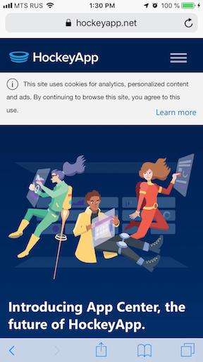

1. Нажать на три полоски в верхнем правом углу, чтобы открыть меню 

    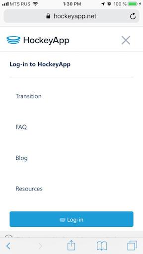

1. Нажать `Log-in`, для открытия окна входа 

    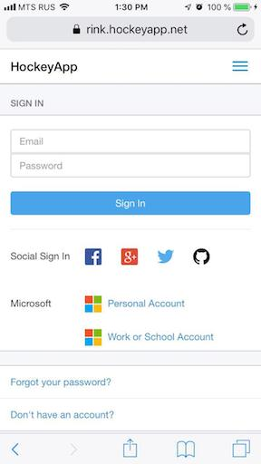

1. Выбрать Microsoft `Personal Account`
    1. Если у вас еще нет аккаунта, вам надо его создать
    1. Если у вас уже есть аккаунт вы можете использоать его.

1. Вам предложат дать доступ к вашему e-mail адресу для hokeyApp 

    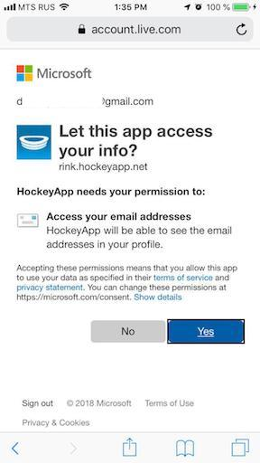

## Регистрация устройства

1. Авторизовавашись вы увидите следующую страницу

    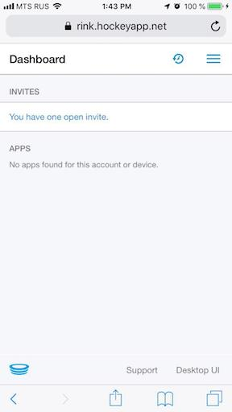

1. Нажмите на 3 полоски в верхнем правом углу, чтобы открыть меню

    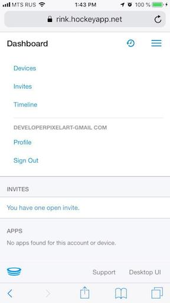

1. Выберите `Devices`

1. На открывшемся экране должен быть список зарегистрированных устройств для данного аккаунта и кнопка `Register Device`, если данное устройство еще не зарегистрировано

    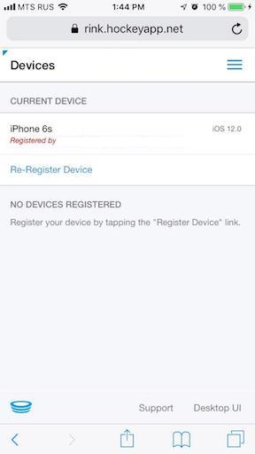

1. Нажав на кнопку `Register Device` или `Re-Register Device` вы увидите следующий экран. Нажимаем `Install`

    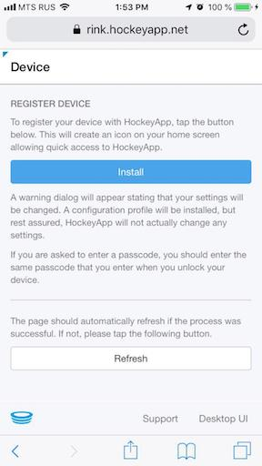

1. При добавлении нового устройства будет предложено установить сертификат на iOS устройство. Нажимаем `Allow`

    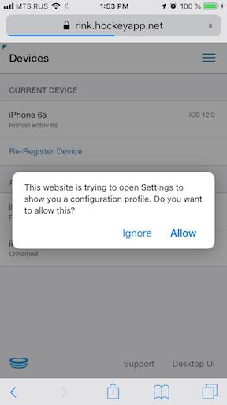

1. Нам покажут сертификат. Нажимаем в верхнем правом углу `Install`

    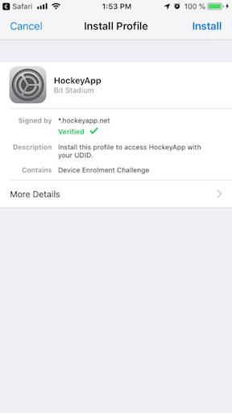

1. Если на устрйостве есть пароль – вводим

    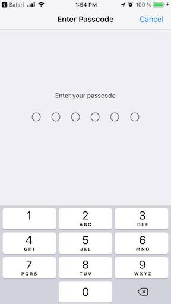

1. В выпавшем меню еще раз подтверждаем установку

    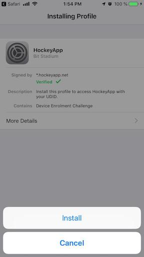

1. Ждем окончания и нажимаем в верхнем правом углу `Done`

    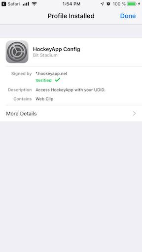
    
## Участие в тестировании

1. Сообщить разработчику свой e-mail в hockeyApp. Для приглашения
1. Получив приглашение на e-mail – принять его